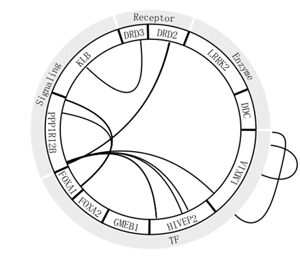
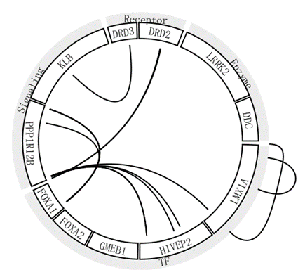
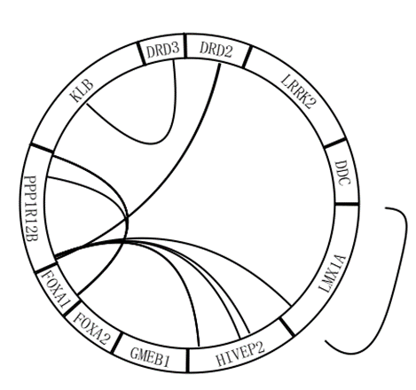
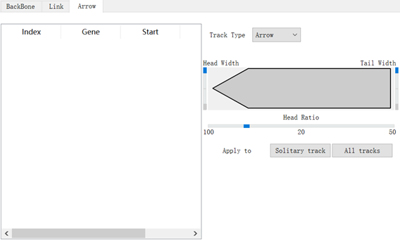

# FreeCircos

## Summary

To Develop A Program for Painting Circos Figure.

## Platform & Version

- Qt5: > 5.12
- Platform: Win32
- cmake: >=3.1.0
- Build Toolchain: msvc x64| mingw64

## TODO List:

1. 对backbone 进行gap调整或者各个部分大小调整之后以及不显示category之后，link没有随着改变而改变
    调整后 link在图上的位置完全没变
   
2. 外部曲线跨度大时不好看
   
3. ~~当没有输入arrow文件时，arrow部分操作会宕机，可以把arrow的solitary track和all track在没有数据是也变灰色~~~~没数据时这里是黑色可以点击的~~
   
4. 导入一个错误的文件时，会弹出错误提示，但是去不掉。。
5. 输入文件导致的bug较多。。
   - 二次load backbone 画图会宕机
   - 先load category 再load backbone 画图会宕机
   - load link选过颜色之后，二次load link 再选择颜色 画图会宕机
6. link 这5个数字是固定的。。 改成默认数值是根据link 数据的数值来分配吧 比如link数据范围是 8-22 那就把这5个值设为7,11,15,29,23反正就是取整5等分，让5等分的数也都是整数就行 ,然后这5个数值最好也是手动可调的。
7. ~link file里面Stre对应的是颜色，还是把这个名词改成col吧,就是把读入的数据改成这种colname
8. link file 把这个lwd信息也读入进去吧，作为line width的信息，也就是每条线的粗细可能不一样, 然后这里的这个数字就作为比例缩放吧, 然后没有lwd这一行信息时，就默认为1，调整line width也可以缩放line width
9. 文字大小可以调整不？ 然后文字也随着这个圆，弧形的展示么
10. ~~加一个旋转角度的功能吧？  就是让这个圆顺时针旋转，弄成数字写角度就行-360-360度~~
    ~~可以加在global setting参数那个界面~~
11. 加一个按钮可以线性化吧？ 就是够上 就不画弧线了 画成一条直线。。
    类似于这样，intro的link 就画在下面，outro的link 就画在上面，category 也画在上面